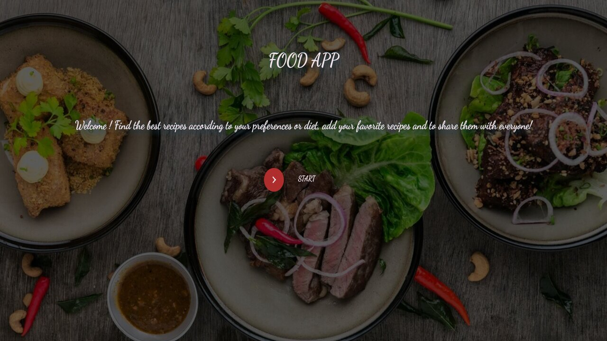
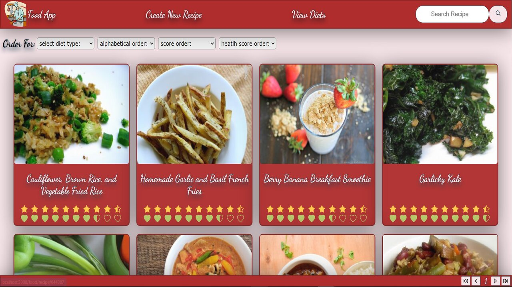
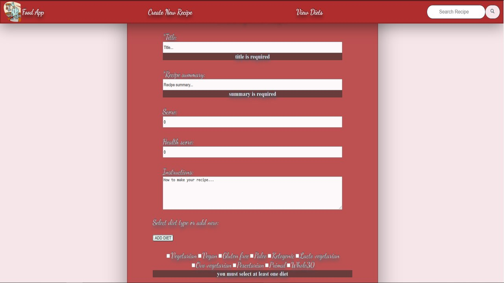

    

# Food-App
- Proyecto realizado en instancia evaluativa en [Soy Henry](https://www.soyhenry.com/) 
- Debía realizar una web de recetas de comidas con sus tipos de dietas. Que renderice una api desde el backend hacia el front y que tambien permita crear tanto nuevas recetas como tipos de dietas.
Otro de los requisitos era no poder usar ninguna libreria ni framework relacionado con los estilos, por lo tanto esta todo diseñado con CSS puro, usando CSS Modules.
- [LINK](https://app-food.vercel.app/)

## Tecnologías utilizadas :computer: 

* __Javascript__
* __React - Redux__
* __Node.Js__
* __Express__
* __PostgreSQL / Sequelize__
 

## Previews 🍝

    

    

    

